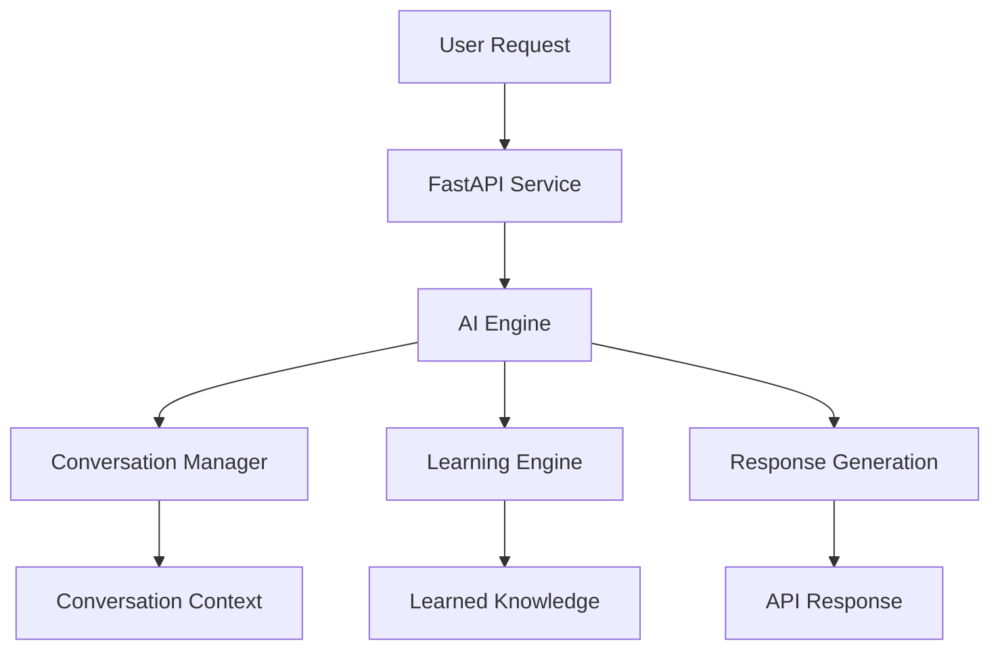

# Sage-AI

Sage-AI is a modular AI assistant framework designed to explore how conversational systems can combine structured reasoning, conversation memory, and incremental learning. The system exposes an AI engine through a FastAPI service, allowing users to interact with the assistant through a simple API.

The project focuses on building the underlying architecture of an AI assistant rather than a single-purpose chatbot. It demonstrates how conversational input can be processed through a reasoning engine that manages context, retrieves learned knowledge, and generates structured responses.

> ⚠️ **Status:** Active development. Core architecture is implemented while additional capabilities are being expanded.

---

## Problem

Most conversational AI systems operate as simple prompt-response tools with no persistent context or structured reasoning layer. This limits their ability to remember information, adapt to users, or evolve through interaction.

Building more capable AI assistants requires an architecture that separates conversation handling, reasoning logic, and knowledge storage.

---

## Solution

Sage-AI implements a modular architecture that allows user input to flow through a structured processing pipeline.

The system manages conversation context, checks previously learned knowledge, and generates responses through a centralized AI engine. This design enables the assistant to learn new information over time while maintaining a clear and explainable processing flow.

---

## System Architecture

Sage-AI follows a service-based architecture where an API layer communicates with a centralized AI processing engine.



### Components

| Component | Description |
|---|---|
| **FastAPI Service** | Provides the HTTP interface used to interact with the assistant. |
| **AI Engine** | Coordinates how user input is processed and determines how responses are generated. |
| **Conversation Manager** | Tracks conversation history and manages contextual information. |
| **Learning Engine** | Stores and retrieves knowledge learned during conversations. |

---

## Current Features

- FastAPI-based conversational API
- Modular AI processing engine
- Conversation tracking
- Rule-based knowledge learning
- Confidence scoring for responses
- Structured response objects for API clients

---

## Project Structure

```
sage-ai/
├── core/
│   ├── ai_engine.py
│   ├── conversation_manager.py
│   └── learning_engine.py
└── main.py
```

- **`main.py`** — Defines the FastAPI application and API endpoints.
- **`ai_engine.py`** — Central orchestration component that processes user inputs.
- **`conversation_manager.py`** — Maintains conversation context.
- **`learning_engine.py`** — Handles storing and retrieving learned knowledge.

---

## API Usage

Start the API server:

```bash
uvicorn main:app --reload
```

The service will run at `http://localhost:8000`.

### Health Check

```http
GET /
```

**Example response:**

```json
{
  "status": "online",
  "service": "Sage v2"
}
```

### Chat Endpoint

```http
POST /chat
```

**Example request:**

```json
{
  "message": "Hello Sage"
}
```

**Example response:**

```json
{
  "response": "I heard: 'Hello Sage'. You can teach me by saying: 'Learn that X means Y.'",
  "confidence": 0.7,
  "source": "simple"
}
```

---

## Example Interaction

```
User:  Learn that Python is my favorite language

Later:

User:  What language do I like?
Sage:  Python
```

This interaction demonstrates how the assistant can retain knowledge through the learning engine.

---

## Roadmap

Planned improvements include:

- [ ] Persistent memory storage using a database
- [ ] Retrieval-augmented responses using external documents
- [ ] Tool integrations (calculations, data queries)
- [ ] Multi-user conversation support
- [ ] Observability and logging
- [ ] Deployment-ready containerization

---

## Purpose of the Project

Sage-AI is intended as a systems engineering project exploring how conversational AI assistants can be structured internally. The goal is to build and iterate on the architecture behind AI assistants rather than focusing solely on model responses.

The project emphasizes modular design, clear system boundaries, and experimentation with conversational learning systems.
